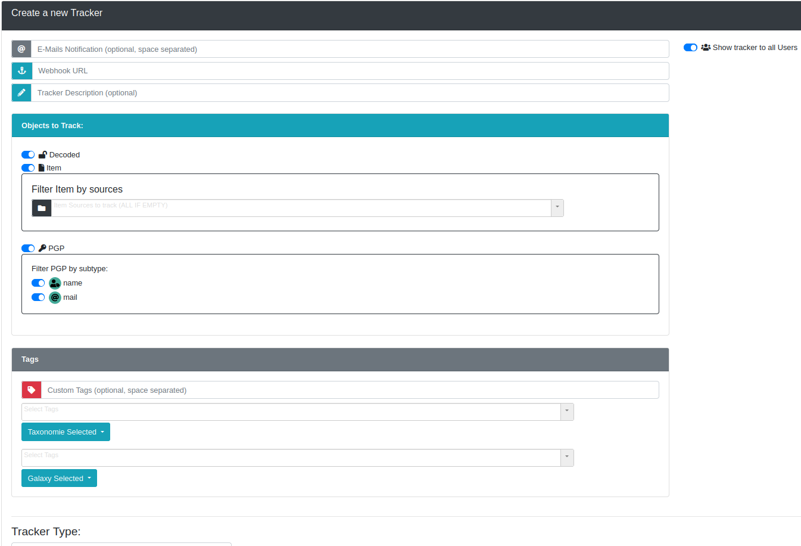
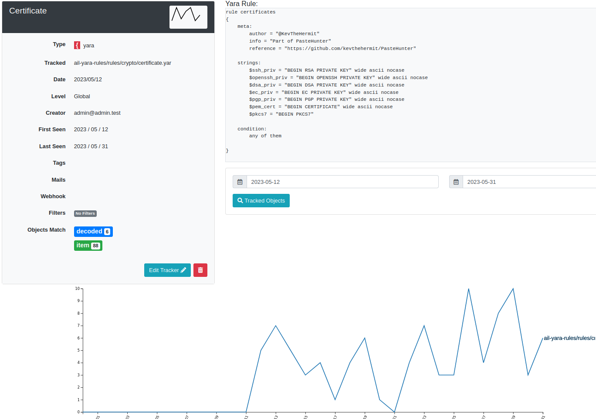
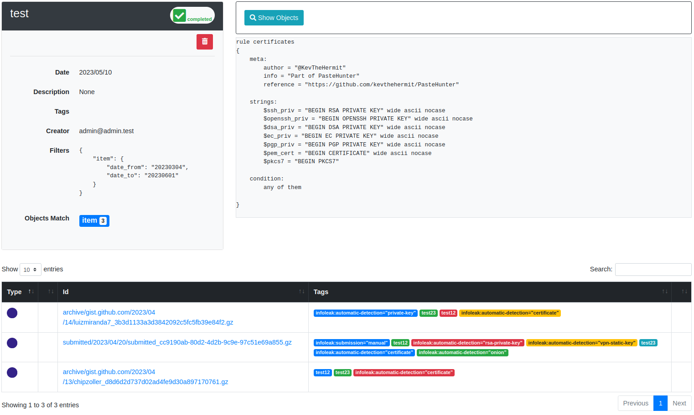
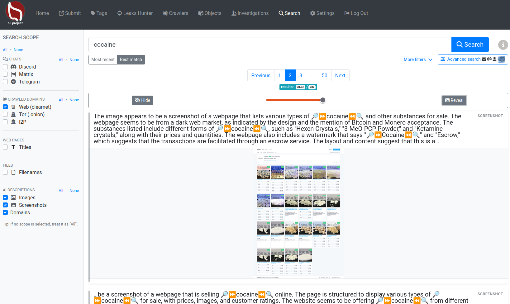

<p align="center">
  
</p>

<h1 align="center">AIL Framework</h1>

<p align="center">
  Open-source framework for the collection, crawling, processing, and analysis of unstructured information.
</p>

<p align="center">
  <a href="https://github.com/ail-project/ail-framework/releases/latest">
    
  </a>
  <a href="https://github.com/ail-project/ail-framework/actions/workflows/ail_framework_test.yml">
    
  </a>
  <a href="https://gitter.im/ail-project/?utm_source=badge&utm_medium=badge&utm_campaign=pr-badge&utm_content=badge">
    
  </a>
  <a href="https://github.com/ail-project/ail-framework/graphs/contributors">
    
  </a>
  <a href="https://github.com/ail-project/ail-framework/blob/master/LICENSE">
    
  </a>
</p>

AIL framework is an open-source platform to **collect, crawl, process and analyse unstructured data** from the clear web, Tor, I2P, chats, files and external feeds.

Originally developed at [CIRCL](https://www.circl.lu/), AIL helps analysts transform raw, messy content into structured intelligence through extraction, tagging, detection, correlation and investigation workflows.


## What is AIL?  https://ail-project.org

AIL (Analysis of Information Leaks) is an open-source framework for the collection, crawling, processing, and analysis of unstructured information. It supports threat intelligence, leak analysis, and investigative workflows by helping analysts extract, detect, correlate, and share relevant information from a wide range of sources.

AIL includes:
- an **extensible Python-based framework** for processing and analysing unstructured information,
- a **crawler manager** for continuous and authenticated collection,
- **feeders** for communication platforms and external streams,
- a **detection and retro-hunt engine** based on keywords, regex and YARA,
- **search, correlation and investigation** capabilities to pivot across extracted data,
- and **export/integration** features for platforms such as [MISP](https://github.com/MISP/MISP).

## AIL intelligence lifecycle

AIL follows a practical intelligence workflow:

1. **Collection**
   Continuous ingestion from chats, websites, hidden services, files and feeds.
2. **Processing**
   Extraction, decoding, OCR, QR/barcode parsing, enrichment and tagging.
3. **Detection**
   Real-time tracking with words, sets, regex, typo-squatting and YARA rules.
4. **Analysis**
   Search, pivoting, correlation graphs and investigations.
5. **Dissemination**
   Export of findings and objects to MISP intelligence-sharing platforms.

## What’s new in AIL v6.7

AIL is now at **v6.7** and recent releases significantly expanded search, image analysis, crawling and document-processing capabilities.

Highlights include:

- **Unified search interface** with best-match and most-recent ordering
- **Date range filtering** and improved advanced search workflows
- **Image and screenshot descriptions** for faster visual analysis and searchability
- **Expanded OCR and QR extraction**, including support for more difficult image cases
- **Full PDF processing pipeline**, including metadata extraction and **translation** support
- **I2P crawling support** in addition to clear web and Tor collection
- **Passive SSH correlation** for infrastructure analysis and deanonymization workflows
- **Improved chat exploration** for platforms such as Discord, Telegram and Matrix

## Features


### Collection

- Modular architecture to handle streams of unstructured information
- Multiple feeder and importer support
- Feeders for chat and stream sources such as [Discord](https://github.com/ail-project/ail-feeder-discord), [Telegram](https://github.com/ail-project/ail-feeder-telegram) and other providers
- Crawling support for the clear web, darknet, **Tor hidden services** (.onion), and **I2P**
- Authenticated crawling with browser sessions, cookies and local storage reuse
- Continuous or on-demand monitoring of websites and hidden services over time
- UI submission/import capabilities

### Processing and enrichment

- Full-text indexing of unstructured information (chats, crawled contents)
- Extraction of URLs, hostnames, email addresses and credentials
- Detection of phone numbers, API keys, IBANs, certificates and private keys
- Detection of Bitcoin addresses, private keys and related cryptocurrency artifacts
- File extraction and decoding from encoded content (Base64, hex)
- OCR processing for screenshots and images
- QR code and barcode extraction with reprocessing of embedded content
- AI-assisted descriptions for images, screenshots and domains
- PDF metadata extraction, ingestion and translation
- Tagging system using [MISP Galaxy](https://github.com/MISP/misp-galaxy) and [MISP Taxonomies](https://github.com/MISP/misp-taxonomies)

### Detection and tracking

Trackers are user-defined rules or patterns that automatically detect, tag and notify analysts about relevant information collected by AIL.

Supported tracker types:

- word tracking
- set-of-words tracking
- regex tracking
- YARA rules
- typo-squatting detection

Detection capabilities include:

- real-time tagging and classification
- object occurrence tracking
- webhook or email notification workflows
- built-in YARA editor

AIL also supports **Retro Hunts**, enabling analysts to run newly created YARA rules against **historical data** to uncover previously missed content.







### Search, correlation and investigation

- Unified search interface with recency and relevancy ordering
- Search by date range and specialized advanced search for selected data types
- Search across chats, crawled domains, titles, filenames and AI-generated descriptions
- Correlation engine and graph visualisation for relationships between:
  - decoded files and hashes
  - PGP metadata
  - domains, titles, dom-hash, favicons, cookie-names
  - usernames and user-accounts
  - CVEs
  - SSH keys
  - cryptocurrencies
  - PDF metadata
  - ...
- Investigation workflow to group, enrich and follow analyst findings



### Export and integrations

- Alerting and sharing to [MISP](https://github.com/MISP/MISP)
- Export of AIL objects and investigations to MISP formats
- Automatic exports on selected detections and tags
- Integrations supporting collaborative intelligence and incident-response workflows

## Why AIL?

AIL is built for analysts who need to work with **messy, real-world data**:

- free text,
- screenshots,
- PDFs and files,
- chat messages,
- encoded payloads,
- content collected from web, Tor and I2P sources.

Instead of treating those sources separately, AIL helps turn them into searchable, correlated and actionable intelligence.

## Screenshots

### Websites, forums and hidden services


#### Login-protected crawling with pre-recorded session cookies


### Extracted and decoded files


### Correlation engine


### Investigation


### Tagging system


### MISP export


### Automatic events and alerts


### UI submission


## Installation

To install the AIL framework:

```bash
# Clone the repository
git clone https://github.com/ail-project/ail-framework.git
cd ail-framework
git submodule update --init --recursive

# Install dependencies on Debian/Ubuntu-based distributions
./installing_deps.sh

# Start AIL
cd bin
./LAUNCH.sh -l
```

The default [installing_deps.sh](./installing_deps.sh) script targets Debian and Ubuntu based distributions.

### Requirements

- Python 3.8+

[How to size the hardware requirements for AIL?](https://ail-project.org/faq.html)

### Installation notes


Some optional components require additional configuration, including the **Lacus crawler**, the **Meilisearch search indexer**, and the **translation**. See the [HOWTO](https://github.com/ail-project/ail-framework/blob/master/HOWTO.md#crawler) for detailed setup instructions.
## Starting AIL

```bash
cd bin
./LAUNCH.sh -l
```

The web interface is available at:

```text
https://localhost:7000/
```

The default credentials are stored in the `DEFAULT_PASSWORD` file and the file is removed once the password is changed.

## Documentation

- Main documentation: [doc/README.md](doc/README.md)
- API documentation: [doc/api.md](doc/api.md)
- HOWTO guides: [HOWTO.md](HOWTO.md)

## Training


Training materials on how to use and extend the AIL framework are available at [ail-project/ail-training](https://github.com/ail-project/ail-training).
## Privacy and GDPR

For information on privacy and GDPR-related considerations, see the document [AIL information leaks analysis and the GDPR in the context of collection, analysis and sharing information leaks](https://www.circl.lu/assets/files/information-leaks-analysis-and-gdpr.pdf).

This document provides guidance on using AIL in a lawful context, especially within the scope of the General Data Protection Regulation.

## Research using AIL

If you use or reference AIL in academic work, you can cite it as follows:

```bibtex
@inproceedings{mokaddem2018ail,
  title={AIL-The design and implementation of an Analysis Information Leak framework},
  author={Mokaddem, Sami and Wagener, G{\'e}rard and Dulaunoy, Alexandre},
  booktitle={2018 IEEE International Conference on Big Data (Big Data)},
  pages={5049--5057},
  year={2018},
  organization={IEEE}
}
```

## License

```text
Copyright (C) 2014 Jules Debra
Copyright (c) 2021 Olivier Sagit
Copyright (C) 2014-2026 CIRCL - Computer Incident Response Center Luxembourg
Copyright (c) 2014-2024 Raphaël Vinot
Copyright (c) 2014-2026 Alexandre Dulaunoy
Copyright (c) 2016-2024 Sami Mokaddem
Copyright (c) 2018-2026 Thirion Aurélien

This program is free software: you can redistribute it and/or modify
it under the terms of the GNU Affero General Public License as published by
the Free Software Foundation, either version 3 of the License, or
(at your option) any later version.

This program is distributed in the hope that it will be useful,
but WITHOUT ANY WARRANTY; without even the implied warranty of
MERCHANTABILITY or FITNESS FOR A PARTICULAR PURPOSE.  See the
GNU Affero General Public License for more details.

You should have received a copy of the GNU Affero General Public License
along with this program.  If not, see <http://www.gnu.org/licenses/>.
```
